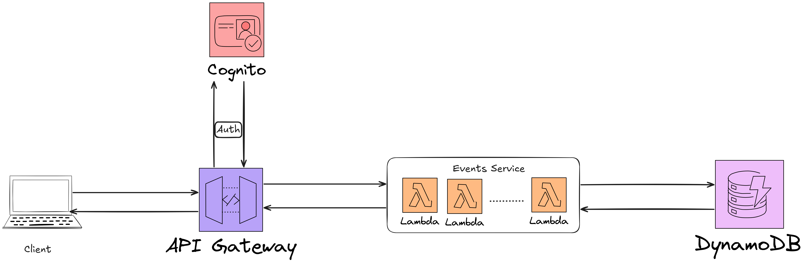

# Event Management API

## Overview

This project implements a serverless Event Management API using FastAPI, AWS Lambda, Amazon API Gateway, and Amazon DynamoDB. It allows authenticated users (organizers) to create, manage, and list events.

## How it Works

The system follows a typical serverless pattern:

1.  **API Gateway:** Receives incoming HTTP requests for event operations (create, read, update, delete, list). It's configured to use AWS Cognito for JWT-based authentication, ensuring that only valid users can access protected endpoints.
2.  **AWS Lambda:** The core application logic, written in Python using the FastAPI framework, runs in AWS Lambda. API Gateway proxies requests to this Lambda function. The `Mangum` adapter allows the ASGI-compliant FastAPI application to run in the Lambda environment.
3.  **FastAPI Application:**
    *   Handles routing of requests to the appropriate endpoint functions.
    *   Uses Pydantic models for request and response data validation and serialization.
    *   Interacts with the `event_manager` service to perform business logic.
4.  **Event Manager Service:** Contains the core logic for event operations, such as creating, retrieving, updating, and deleting events. It interacts directly with Amazon DynamoDB.
5.  **Amazon DynamoDB:** A NoSQL database used to store event data. It's designed with a primary key (`eventId`) and a Global Secondary Index (`organizerId-index`) to support efficient querying by organizer.
6.  **AWS Cognito:** Manages user authentication. Users (specifically "Organizers") obtain JWT tokens from Cognito, which are then included in the `Authorization` header of their API requests. API Gateway validates these tokens before passing requests to the Lambda function.

All AWS resources are provisioned and managed using Terraform.

## Tech Stack

*   **Python 3.12:** The primary programming language for the Lambda function.
*   **FastAPI:** A modern, fast (high-performance) web framework for building APIs with Python 3.7+ based on standard Python type hints.
    *   *Why FastAPI?* Chosen for its developer-friendly nature, automatic data validation (via Pydantic), OpenAPI and JSON Schema generation, dependency injection system, and excellent performance.
*   **Mangum:** An adapter for running ASGI applications (like FastAPI) in AWS Lambda.
    *   *Why Mangum?* It bridges the gap between the ASGI standard used by FastAPI and the event-driven model of AWS Lambda.
*   **Pydantic:** Data validation and settings management using Python type annotations.
    *   *Why Pydantic?* Used extensively by FastAPI for request/response modeling and validation. Also used for managing application settings.
*   **Boto3:** The AWS SDK for Python, enabling Python developers to write software that makes use of services like Amazon S3, Amazon EC2, DynamoDB, etc.
    *   *Why Boto3?* Essential for interacting with AWS services, particularly DynamoDB in this project.

## AWS Services Used

*   **AWS Lambda:** A serverless compute service that lets you run code without provisioning or managing servers.
    *   *Why AWS Lambda?* Chosen for its scalability, cost-effectiveness (pay-per-use), and seamless integration with API Gateway, allowing the API to scale automatically based on demand.
*   **Amazon API Gateway (HTTP API):** A fully managed service that makes it easy for developers to create, publish, maintain, monitor, and secure APIs at any scale.
    *   *Why API Gateway?* It provides a robust entry point for the API, handles request routing to Lambda, integrates with AWS Cognito for authentication, and offers features like traffic management, CORS support, and monitoring.
*   **Amazon DynamoDB:** A key-value and document database that delivers single-digit millisecond performance at any scale.
    *   *Why DynamoDB?* It's a fully managed, serverless NoSQL database that offers high scalability and performance, making it suitable for applications with variable workloads like an event management system.
*   **AWS Cognito:** Provides authentication, authorization, and user management for web and mobile apps.
    *   *Why Cognito?* Chosen for its robust security features, ease of integration with API Gateway for JWT-based authorization, and ability to manage user pools.
*   **AWS IAM (Identity and Access Management):** Enables you to manage access to AWS services and resources securely.
    *   *Why IAM?* Used to define roles and permissions for the Lambda function, ensuring it has the necessary access to other AWS services (like DynamoDB and CloudWatch Logs) while adhering to the principle of least privilege.

## Infrastructure as Code (IaC)

*   **Terraform:** An open-source infrastructure as code software tool that enables you to safely and predictably create, change, and improve infrastructure.
    *   *Why Terraform?* It allows for defining and provisioning all AWS resources in a declarative way, promoting consistency, repeatability, and version control of the infrastructure. Terraform's state management helps track resources and manage complex dependencies.

## Architecture Diagram



## Reproducing the System (Manual Setup)

Follow these steps to deploy the Event Management API to your AWS account.

### Prerequisites

1.  **AWS Account & CLI:**
    *   An active AWS account.
    *   AWS CLI installed and configured with credentials that have permissions to create the necessary resources (IAM roles, Lambda functions, API Gateway, DynamoDB table).
    *   Ensure your AWS CLI is configured for the desired region.
2.  **Terraform:**
    *   Terraform (version specified in `infrastructure/providers.tf` or latest stable) installed.
3.  **Python & Pip:**
    *   Python 3.12 or later.
    *   Pip (Python package installer).
4.  **Make:**
    *   The `make` utility installed (common on Linux/macOS, can be installed on Windows via tools like Chocolatey or WSL).
5.  **AWS Cognito User Pool & App Client:**
    *   You must have an existing AWS Cognito User Pool.
    *   You need an App Client configured for this User Pool. The App Client ID will be used in the Terraform variables.

### Setup Steps

1.  **Clone the Repository:**
    ```bash
    git clone https://github.com/Muhammad-Abdelsattar/Events-Management-System.git events_management_system
    cd events_management_system
    ```

2.  **Configure Terraform Variables:**
    Navigate to the `infrastructure` directory:
    ```bash
    cd infrastructure
    ```
    Create a file named `terraform.tfvars`. This file will contain the specific values for your deployment.

    The following variables are **required**:
    *   `user_pool_id`: The ID of your existing AWS Cognito User Pool (e.g., `us-east-1_XXXXXXXXX`).
    *   `cognito_client_id`: The App Client ID within your User Pool that the API will use (e.g., `xxxxxxxxxxxxxxxxxxxxxx`).

    The following variables have defaults but can be overridden:
    *   `aws_region`: The AWS region for deployment (defaults to `us-east-1`).
    *   `events_table_name`: Name for the DynamoDB table (defaults to `events-table`).
    *   `events_function_name`: Name for the Lambda function (defaults to `events-function`).
    *   `events_function_path`: API Gateway path for the function (defaults to `/events/{proxy+}`).

    Example `terraform.tfvars`:
    ```terraform
    # REQUIRED VARIABLES
    user_pool_id      = "us-east-1_XXXXXXXXX" # Replace with your Cognito User Pool ID
    cognito_client_id = "xxxxxxxxxxxxxxxxxxxxxx"  # Replace with your Cognito App Client ID

    # OPTIONAL VARIABLES (examples, uncomment and change if needed)
    # aws_region           = "us-west-2"
    # events_table_name    = "production-events-table"
    # events_function_name = "EventsApiProd"
    # events_function_path = "/api/v1/events/{proxy+}"
    ```

3.  **Build Lambda Package:**
    Return to the project root directory and run the `deps` command to prepare the Lambda deployment package:
    ```bash
    cd ..
    make deps
    ```
    This command cleans any previous build, copies the Lambda source code to a `build` directory, and installs Python dependencies into it.

4.  **Initialize Terraform:**
    This command downloads the necessary provider plugins.
    ```bash
    make init
    ```

5.  **Plan Infrastructure:**
    Review the resources Terraform will create:
    ```bash
    make plan
    ```
    Inspect the output carefully to understand the changes.

6.  **Apply Infrastructure:**
    Deploy the resources to your AWS account:
    ```bash
    make apply
    ```
    Terraform will ask for confirmation before proceeding. Type `yes` to approve.

7.  **Accessing the API:**
    Once `make apply` completes successfully, Terraform will output the API endpoint URL. You can use this URL to interact with your deployed API. You will need a valid JWT token from your Cognito User Pool to access the authenticated endpoints.

## Available `make` commands

The `Makefile` in the root directory provides several commands to streamline common tasks:

*   `make help`: Displays a list of all available commands and their descriptions.
*   `make deps`: Cleans previous build artifacts and creates the Lambda deployment package in the `build/` directory, including installing Python dependencies.
*   `make init`: Initializes Terraform in the `infrastructure` directory (run after `deps` if building for the first time or after provider changes).
*   `make plan`: Generates a Terraform execution plan, showing what infrastructure changes will be made.
*   `make apply`: Applies the Terraform configuration to create or update resources in AWS. Prompts for confirmation.
*   `make destroy`: Destroys all resources managed by Terraform in this project. Prompts for confirmation.
*   `make clean`: Removes the `build/` directory, Terraform cache files (`.terraform`, `.terraform.lock.hcl`), and any zip files in the `infrastructure` directory.
